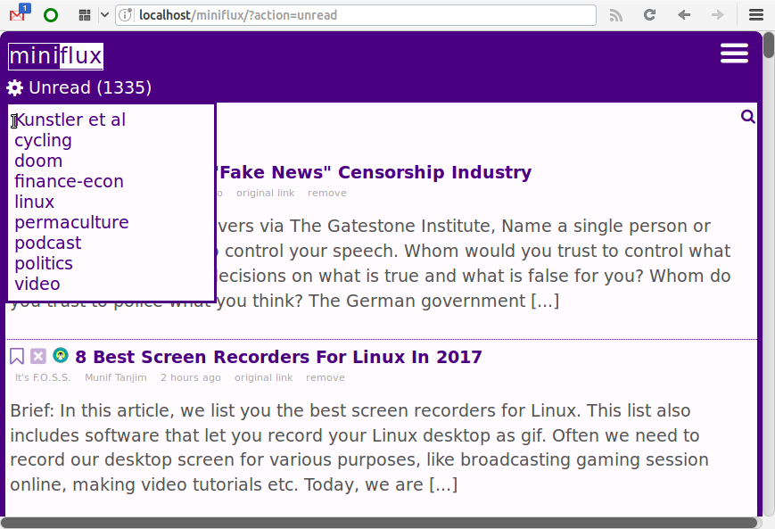
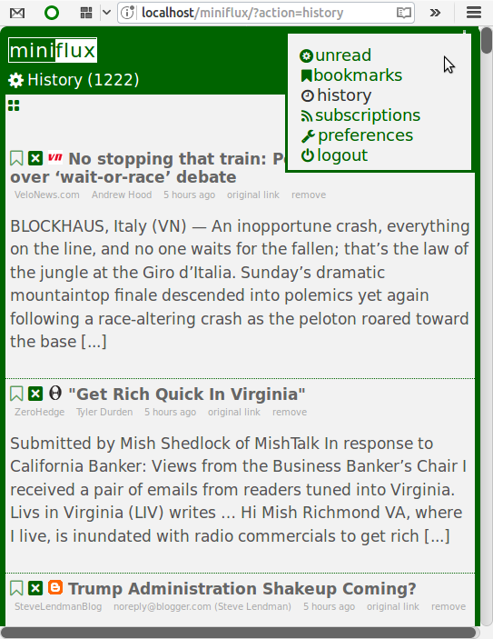
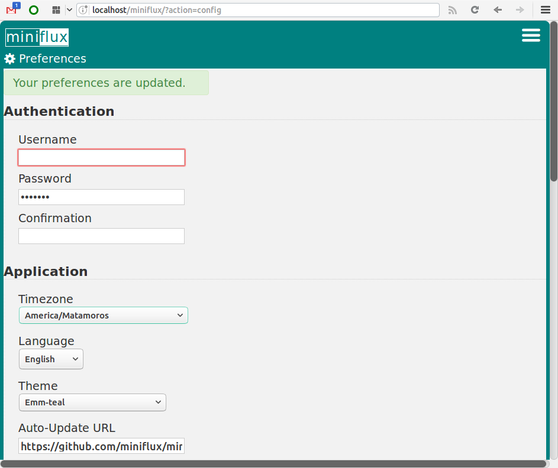
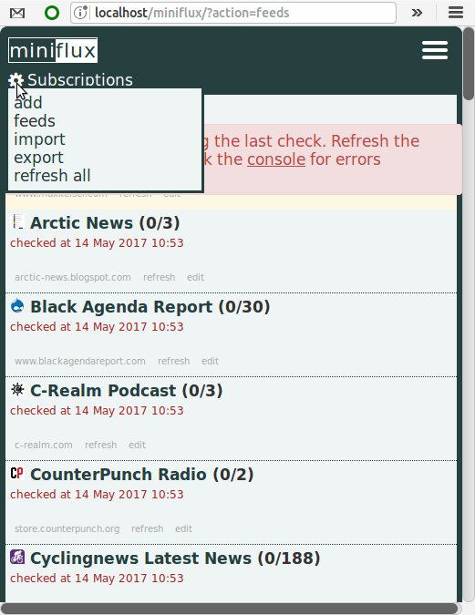

# Even More Miniamalist (emm) minflux-theme
A theme with 6 color variations for the Miniflux RSS Reader

## No Responsive Design Necessary!  
Mobile layouts are minimalist, Miniflux is not a simple program, but it is a simple layout, with just 1 column of data.  The whole idea of the program of the program is minimalism, so the even-more-minimalist(emm) theme has only one design that works across all screen sizes.  

## Other Features
Streamlines the interface by hiding Navagation links, groups and specific page tasks and options behind popup menus.  
Clean looking Sans-Serif Fonts.  
Text labels are replaced with with big fat icons that are more mobile tap friendly and look better on both mobile and the desktop.  Two tone look with the header, border and links and a white or off-white background.  
Default theme of Indigo and options for Maroon, Teal, Forest, Darkslate and Radiance (based on Ubuntu's radiance)

## Easily add Your Own Color Scheme
With a rudumentary or even no understanding of CSS it is very easy make a theme for whatever color you want.  Just take look at any of the app.css files (except the main Indigo one) for instructions.  Sorry no dark themes.  I personally don't like dark themes, so I wouldn't know how to make one.  To hack a dark theme you in addition to the above you would have to change a lot of font settings too in the base css file, which is /emm-indigo/css/app.css.  

../emm-indigo/app.css must be installed for all the other colored themes to work.

## Screenshots

! [radience theme](radience.theme.png)

